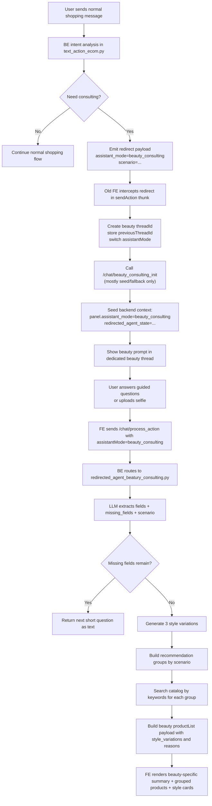

# Beauty Expert Migration Analysis

## Scope

This document maps the Beauty Expert feature as implemented across:

- Backend: `micro-abilities` on branch `agent_redirect_modes_clean`
- Old frontend: `robot-engine-lean` on branch `agent-redirect-mode`
- Target frontend: `gengage-assistant-fe` on `main`

The goal is to understand how Beauty Expert works today and what needs to be ported into `gengage-assistant-fe`.

## Executive Summary

Beauty Expert is not a standalone product search page. It is a guided assistant mode that sits on top of the normal shopping chat flow.

The feature has 3 layers:

1. Intent redirect in backend e-commerce chat
2. Guided-mode state machine in frontend
3. Expert-specific product presentation in frontend

The redirect starts in normal shopping chat. If the backend detects a guided beauty need, it emits a `redirect` response with `assistant_mode = beauty_consulting`. The old frontend then opens a separate Beauty Expert thread, seeds beauty state, and continues the conversation in guided mode. Once enough preference fields are collected, the backend generates 3 style variations, runs keyword-based product retrieval per variation, and sends a `productList` payload with beauty-specific metadata such as:

- `source: "beauty_consulting"`
- `style_variations`
- `recommendation_groups`
- `product_list_w_reason`
- `chat_text_brief`
- `chat_text_mobile`

The old FE renders those structures with custom UI. The new FE can already receive redirects and backend context, but it does not yet have the guided-mode state machine or the beauty-specific product grid behavior.

## Implementation Status in `codex/expert-mode-packaging`

The branch now implements the core migration requirements:

- Shared expert-mode capability exists and supports at least:
  - `beauty_consulting`
  - `watch_expert`
- Beauty state contract is aligned to backend:
  - `redirected_agent_state` is used for panel sync/persistence.
- Beauty attachment flow is integrated:
  - user image upload in beauty mode is normalized client-side
  - request is sent as multipart attachment with `inputText`
  - progress text mapping is rendered while waiting for backend responses.
- Transcript behavior is stabilized for expert threads:
  - same-thread follow-up requests use bottom anchoring instead of thread-start anchoring to avoid upward jump.

## Requirements Analysis

This section maps the 4 transfer requirements directly.

### Requirement 1. Expert mode must be a reusable capability, not a beauty-only feature

This is correct and matches what already exists conceptually in the old FE and backend.

Evidence:

- Backend supports multiple consultant sub-modes via [`IntentHandleSubType`](/Users/omerakkentli/oaworkspace/Gengage4ALL/micro-abilities/src/flow/chat_api.py#L241)
  - `beauty_consulting`
  - `watch_expert`
- Old FE also models expert modes as sibling modes in [`interface/src/store/chat/index.ts`](/Users/omerakkentli/oaworkspace/Gengage4ALL/robot-engine-lean/interface/src/store/chat/index.ts#L54)
  - `beautyConsultingState`
  - `watchExpertState`
- Watch expert bootstrap mirrors beauty bootstrap in [`interface/src/store/chat/thunks/watchExpertMode.ts`](/Users/omerakkentli/oaworkspace/Gengage4ALL/robot-engine-lean/interface/src/store/chat/thunks/watchExpertMode.ts#L63)
- Watch expert backend also follows the same pattern in [`src/action/text_action_watch_expert.py`](/Users/omerakkentli/oaworkspace/Gengage4ALL/micro-abilities/src/action/text_action_watch_expert.py#L900)

So in `gengage-assistant-fe`, the right target is:

- one shared **Expert Mode capability**
- many mode definitions on top of it:
  - Beauty Expert
  - Watch Expert
  - future experts

### Requirement 2. Shopping chat must hand off the user intent cleanly into expert mode

This is also how the system is intended to work today.

Observed transfer behavior:

1. User types in shopping chat
2. Backend intent logic decides if expert mode is needed
3. Backend emits `redirect`
4. FE enters expert mode
5. FE passes transfer text / handoff context into expert init
6. Expert assistant starts with awareness of the original user intent

Evidence:

- Beauty redirect originates in [`text_action_ecom.py`](/Users/omerakkentli/oaworkspace/Gengage4ALL/micro-abilities/src/action/text_action_ecom.py#L477)
- Beauty init derives transfer text in [`beautyConsultingMode.ts`](/Users/omerakkentli/oaworkspace/Gengage4ALL/robot-engine-lean/interface/src/store/chat/thunks/beautyConsultingMode.ts#L107)
- Watch init does the same in [`watchExpertMode.ts`](/Users/omerakkentli/oaworkspace/Gengage4ALL/robot-engine-lean/interface/src/store/chat/thunks/watchExpertMode.ts#L83)
- Beauty backend prompt explicitly says the first message must use transfer text and recent context in [`redirected_agent_beatury_consulting.py`](/Users/omerakkentli/oaworkspace/Gengage4ALL/micro-abilities/src/action/redirected_agent_beatury_consulting.py#L29)
- Watch backend prompt does the same in [`text_action_watch_expert.py`](/Users/omerakkentli/oaworkspace/Gengage4ALL/micro-abilities/src/action/text_action_watch_expert.py#L53)

Important transfer nuance:

The old FE preserves handoff quality even though the backend redirect payload is imperfect.

Current mismatch:

- backend beauty redirect sends `user_text`
- old FE expects `prefill.transfer_text`

Because old FE also derives transfer text locally from the last shopping user message, the handoff still works. The new FE should preserve that fallback behavior.

### Requirement 3. While in expert mode, shopping assistant artifacts must be blocked

This requirement is directionally correct, but it is stricter than the current old FE behavior.

Current old FE behavior:

- watch mode can still surface `suggestedActions` in [`sendAction.ts`](/Users/omerakkentli/oaworkspace/Gengage4ALL/robot-engine-lean/interface/src/store/chat/thunks/sendAction.ts#L514)
- shopping artifact suppression is only enforced for booking in [`sendAction.ts`](/Users/omerakkentli/oaworkspace/Gengage4ALL/robot-engine-lean/interface/src/store/chat/thunks/sendAction.ts#L527)

Current new FE leak points that would violate the requirement:

- typing indicator always starts in [`src/chat/index.ts`](/Users/omerakkentli/oaworkspace/Gengage4ALL/gengage-assistant-fe/src/chat/index.ts#L1477)
- loading/thinking steps are applied from metadata in [`src/chat/index.ts`](/Users/omerakkentli/oaworkspace/Gengage4ALL/gengage-assistant-fe/src/chat/index.ts#L2194)
- suggestion pills are rendered in [`src/chat/components/ChatDrawer.ts`](/Users/omerakkentli/oaworkspace/Gengage4ALL/gengage-assistant-fe/src/chat/components/ChatDrawer.ts#L1265)
- input chips are extracted from `ActionButtons` in [`src/chat/index.ts`](/Users/omerakkentli/oaworkspace/Gengage4ALL/gengage-assistant-fe/src/chat/index.ts#L2019)
- panel loading skeletons are shown from metadata in [`src/chat/index.ts`](/Users/omerakkentli/oaworkspace/Gengage4ALL/gengage-assistant-fe/src/chat/index.ts#L2131)

Target behavior should be:

- no shopping suggestion pills
- no shopping input chips
- no shopping search/analyze loading copy
- no shopping list preview behaviors
- no generic shopping artifact rendering while expert mode is active
- only expert conversation + expert-tailored result pane

### Requirement 4. Expert mode must be strict about info collection and then show a custom expert pane

This is strongly supported by both beauty and watch implementations.

Beauty:

- strict field collection and `missing_fields` in [`redirected_agent_beatury_consulting.py`](/Users/omerakkentli/oaworkspace/Gengage4ALL/micro-abilities/src/action/redirected_agent_beatury_consulting.py#L178)
- once fields are sufficient, generate expert recommendation pane in [`redirected_agent_beatury_consulting.py`](/Users/omerakkentli/oaworkspace/Gengage4ALL/micro-abilities/src/action/redirected_agent_beatury_consulting.py#L959)

Watch:

- strict data collection and ready-for-grouping logic in [`text_action_watch_expert.py`](/Users/omerakkentli/oaworkspace/Gengage4ALL/micro-abilities/src/action/text_action_watch_expert.py#L965)
- then expert-tailored `productList` payload with variations and groups in [`text_action_watch_expert.py`](/Users/omerakkentli/oaworkspace/Gengage4ALL/micro-abilities/src/action/text_action_watch_expert.py#L1049)

So the FE capability must support:

- expert-specific stateful collection
- expert-specific exit/entry flow
- expert-specific panel rendering
- expert-specific rules for what artifacts are allowed

## End-to-End Flow



## Shared Expert Capability Model

The best transfer shape for `gengage-assistant-fe` is a shared controller with per-expert definitions.

### Core abstraction

Create one internal capability concept:

- `ExpertModeController`

And register expert definitions like:

- `beauty_consulting`
- `watch_expert`

### Proposed expert definition shape

Each expert definition should own only the pieces that are truly different:

- `modeId`
- `contextPanelKey`
- `stateKey`
- `sourceName`
- `initEndpoint`
- `handoffLoadingText`
- `fallbackPromptBuilder`
- `visibleFieldOrder`
- `headerTitle`
- `headerSubtitleBuilder`
- `progressStepsBuilder`
- `productRendererVariant`
- `artifactPolicy`

Example conceptual shape:

```ts
type ExpertModeDefinition = {
  modeId: 'beauty_consulting' | 'watch_expert';
  contextPanelKey: 'redirected_agent_state' | 'watch_expert_state';
  sourceName: 'beauty_consulting' | 'watch_expert';
  initEndpoint?: '/chat/beauty_consulting_init' | '/chat/watch_expert_init';
  handoffLoadingText: string;
  fallbackPrompt: (missingFields: string[]) => string;
  productRendererVariant: 'beauty' | 'watch';
  artifactPolicy: {
    blockShoppingPills: true;
    blockShoppingChips: true;
    blockThinkingSteps: true;
    blockShoppingPanelLoading: true;
  };
};
```

### Shared expert state

Instead of separate ad hoc widget booleans, keep one shared state shape:

- `activeMode`
- `threadId`
- `previousThreadId`
- `scenario`
- `status`
- `handoffSummary`
- `transferText`
- `fields`
- `missingFields`
- `source`
- `extra`

Then allow mode-specific extras:

- Beauty:
  - `photoFindings`
  - `photoStepState`
- Watch:
  - `questionCount`
  - `selectionCriteria`
  - `stage`

This prevents re-copying the entire flow for every expert.

## Backend Mapping

### 1. Redirect entry point

The redirect decision lives in [`src/action/text_action_ecom.py`](/Users/omerakkentli/oaworkspace/Gengage4ALL/micro-abilities/src/action/text_action_ecom.py#L347).

Important behavior:

- Loads account-level consultant config via `ConfigType.CONSULTANT_CONFIG`
- Extends intent analysis schema with:
  - `need_consulting`
  - `consulting_mode`
- If `need_consulting` is true, emits:
  - `type=REDIRECT`
  - `payload.assistant_mode = beauty_consulting`
  - `payload.scenario = consulting_mode || "general"`
  - `payload.user_text = text`

Redirect emit point: [`src/action/text_action_ecom.py`](/Users/omerakkentli/oaworkspace/Gengage4ALL/micro-abilities/src/action/text_action_ecom.py#L477)

### 2. Beauty mode routing

Once backend context contains `assistant_mode = beauty_consulting`, text input is rerouted in [`src/action/text_action.py`](/Users/omerakkentli/oaworkspace/Gengage4ALL/micro-abilities/src/action/text_action.py#L22).

Routing behavior:

- Reads `last_panel["assistant_mode"]`
- If beauty mode, calls `handle_redirect_agent_text_input(...)`

### 3. Shared enums and init request

Beauty mode types are defined in:

- [`src/flow/config_types.py`](/Users/omerakkentli/oaworkspace/Gengage4ALL/micro-abilities/src/flow/config_types.py#L25)
- [`src/flow/chat_api.py`](/Users/omerakkentli/oaworkspace/Gengage4ALL/micro-abilities/src/flow/chat_api.py#L205)

Important values:

- `ConsultantTypes.BEAUTY = "beauty_consulting"`
- `IntentHandleSubType.BEAUTY = "beauty_consulting"`
- `BeautyConsultingInitRequest` accepts:
  - `account_id`
  - `scenario`
  - `transfer_text`
  - `handoff_summary`
  - `known_fields`

### 4. `/chat/beauty_consulting_init` reality

Init endpoint is in [`src/app.py`](/Users/omerakkentli/oaworkspace/Gengage4ALL/micro-abilities/src/app.py#L472).

Current behavior:

- Echoes `scenario`
- Echoes `handoff_summary`
- Echoes `known_fields`
- Returns empty `missing_fields`
- Returns empty `assistant_reply`

This means the endpoint is mostly a frontend seeding helper, not the real business logic engine.

### 5. Account config and style guide

Flormar account config is in [`src/accounts/flormarcomtr.py`](/Users/omerakkentli/oaworkspace/Gengage4ALL/micro-abilities/src/accounts/flormarcomtr.py#L47).

Beauty-specific account resources:

- `ConfigType.CONSULTANT_CONFIG = beauty_consulting`
- consultant prompts:
  - `CONSULTANT_SYSTEM_PROMPT`
  - `CONSULTANT_NEED_PROMPT`
  - `CONSULTANT_MODE_PROMPT`
- `ConfigType.STYLE_GUIDE = CELEBRITY_STYLE_GALLERY`

Style guide structure per entry:

- `style_id`
- `name`
- `description`
- `tags`
- `image_url`

Image URLs reference frontend remote config assets such as:

- `/remoteConfig/beauty-styles/natural_glow.png`
- `/remoteConfig/beauty-styles/soft_glam.png`
- `/remoteConfig/beauty-styles/smokey_eye.png`

### 6. Beauty conversation state extraction

Main logic is in [`src/action/redirected_agent_beatury_consulting.py`](/Users/omerakkentli/oaworkspace/Gengage4ALL/micro-abilities/src/action/redirected_agent_beatury_consulting.py#L18).

Core responsibilities:

- Builds beauty consultant system prompt
- Extracts structured fields with Gemini
- Tracks missing fields
- Creates handoff summary
- Creates style variations
- Builds keyword recommendation plans
- Retrieves products from catalog
- Sends beauty-specialized `productList` payload

Collected beauty fields:

- `goal_summary`
- `skin_profile`
- `coverage_preference`
- `finish_preference`
- `look_style`
- `budget_preference`
- `recipient_profile`
- `experience_level`

State build point: [`src/action/redirected_agent_beatury_consulting.py`](/Users/omerakkentli/oaworkspace/Gengage4ALL/micro-abilities/src/action/redirected_agent_beatury_consulting.py#L150)

### 7. Style variations and recommendation planning

Style guide helpers:

- [`get_style_guide()`](/Users/omerakkentli/oaworkspace/Gengage4ALL/micro-abilities/src/action/redirected_agent_beatury_consulting.py#L260)
- [`get_style_guide_images()`](/Users/omerakkentli/oaworkspace/Gengage4ALL/micro-abilities/src/action/redirected_agent_beatury_consulting.py#L285)

Recommendation plan builder:

- [`_build_keyword_recommendation_plan()`](/Users/omerakkentli/oaworkspace/Gengage4ALL/micro-abilities/src/action/redirected_agent_beatury_consulting.py#L467)

Scenario behavior:

- `shade_advisor`
  - foundation
  - concealer
  - primer
- `routine_builder`
  - primer
  - foundation
  - accent product
  - lip product
- `gift_builder`
  - starter/gift-oriented makeup set composition

Variation generation:

- [`get_style_variation_response()`](/Users/omerakkentli/oaworkspace/Gengage4ALL/micro-abilities/src/action/redirected_agent_beatury_consulting.py#L669)

Product collection:

- [`_collect_variation()`](/Users/omerakkentli/oaworkspace/Gengage4ALL/micro-abilities/src/action/redirected_agent_beatury_consulting.py#L787)

### 8. Final payload sent to frontend

Final response assembly starts in [`handle_redirect_agent_text_input()`](/Users/omerakkentli/oaworkspace/Gengage4ALL/micro-abilities/src/action/redirected_agent_beatury_consulting.py#L919).

Behavior:

- Stores `last_panel["assistant_mode"] = beauty_consulting`
- Stores `last_panel["redirected_agent_state"] = updated_states`
- If still collecting:
  - sends text question only
- If ready:
  - sends `loading`
  - sends text summary HTML
  - sends `productList`
  - sends debug log

Beauty-specific `productList` payload fields:

- `title`
- `product_list`
- `source = "beauty_consulting"`
- `chat_text_brief`
- `chat_text_mobile`
- `style_variations`
- `llm_ranked_skus`
- `recommendation_groups`
- `product_list_w_reason`

Product reason payload shape:

- `selection_reasons.beauty_consulting.text`

## Old Frontend Mapping

## FE State Model

The old FE adds explicit guided-mode state in [`interface/src/store/chat/index.ts`](/Users/omerakkentli/oaworkspace/Gengage4ALL/robot-engine-lean/interface/src/store/chat/index.ts#L54).

Key state:

- `assistantMode`
- `beautyConsultingState.active`
- `beautyConsultingState.threadId`
- `beautyConsultingState.previousThreadId`
- `beautyConsultingState.scenario`
- `beautyConsultingState.status`
- `beautyConsultingState.handoffSummary`
- `beautyConsultingState.photoFindings`
- `beautyConsultingState.photoStepState`
- `beautyConsultingState.fields`
- `beautyConsultingState.missingFields`

Reducers:

- `enterBeautyConsultingMode`
- `updateBeautyConsultingState`
- `exitBeautyConsultingMode`

## Redirect interception

Redirect interception happens in [`interface/src/store/chat/thunks/sendAction.ts`](/Users/omerakkentli/oaworkspace/Gengage4ALL/robot-engine-lean/interface/src/store/chat/thunks/sendAction.ts#L647).

Behavior:

- When backend emits `redirect` with `assistant_mode = beauty_consulting`
- Adds handoff bot message to current thread
- Invalidates current thread
- Shows loading message
- Waits briefly
- Calls `openBeautyConsulting(...)`

Important detail:

The frontend expects `redirectPayload.prefill.transfer_text`, but backend currently sends `user_text`. Old FE still survives because it can derive fallback transfer text locally.

## Beauty-mode bootstrap

Beauty-mode bootstrap lives in [`interface/src/store/chat/thunks/beautyConsultingMode.ts`](/Users/omerakkentli/oaworkspace/Gengage4ALL/robot-engine-lean/interface/src/store/chat/thunks/beautyConsultingMode.ts#L87).

What it does:

- Cancels any active request
- Prevents double-entry if already active
- Creates `beautyThreadId = uuidv7()`
- Saves `previousThreadId`
- Computes `knownFields`
- Derives `transferText`
- Computes default missing field order
- Switches Redux state into beauty mode
- Calls `/chat/beauty_consulting_init`
- Seeds backend context into IndexedDB
- Adds first assistant message into beauty thread

Seeded backend context shape:

- `panel.assistant_mode = beauty_consulting`
- `panel.redirected_agent_state.scenario`
- `panel.redirected_agent_state.status`
- `panel.redirected_agent_state.handoff_summary`
- `panel.redirected_agent_state.transfer_text`
- `panel.redirected_agent_state.photo_findings`
- `panel.redirected_agent_state.fields`
- `panel.redirected_agent_state.missing_fields`
- `panel.redirected_agent_state.source`

## Request contract to backend

Backend request plumbing is in [`interface/src/store/client.ts`](/Users/omerakkentli/oaworkspace/Gengage4ALL/robot-engine-lean/interface/src/store/client.ts#L75).

Important Beauty-specific FE behavior:

- Sends `meta.assistantMode`
- Sends `context`
- Supports attachment upload via `FormData`
- Calls `/chat/beauty_consulting_init`

This is important because guided turns must keep telling backend which sub-mode is active.

## Thread isolation

Beauty mode is rendered as a separate thread, not just a visual banner.

Selector logic is in [`interface/src/store/chat/selectors.ts`](/Users/omerakkentli/oaworkspace/Gengage4ALL/robot-engine-lean/interface/src/store/chat/selectors.ts#L52).

Behavior:

- If `assistantMode === beauty_consulting`
- Only messages from `beautyConsultingState.threadId` are visible

This is one of the most important transfer concepts.

## Beauty header and mode shell

Header mode shell is in [`interface/src/components/ChatHeader.tsx`](/Users/omerakkentli/oaworkspace/Gengage4ALL/robot-engine-lean/interface/src/components/ChatHeader.tsx#L326).

UI behavior:

- Shows Beauty Expert mode banner
- Displays scenario / subtitle
- Shows `Alisverise Don` button
- Shows progress chips:
  - `Ihtiyac`
  - `Tercihler`
  - `Oneriler`

## Guided image upload

Beauty image upload behavior is split across three places.

Thread-aware image submit:

- [`interface/src/components/ChatPane/index.tsx`](/Users/omerakkentli/oaworkspace/Gengage4ALL/robot-engine-lean/interface/src/components/ChatPane/index.tsx#L96)

Input placeholders and upload handling:

- [`interface/src/components/ChatPane/ChatInput/index.tsx`](/Users/omerakkentli/oaworkspace/Gengage4ALL/robot-engine-lean/interface/src/components/ChatPane/ChatInput/index.tsx#L128)

Photo step card:

- [`interface/src/components/ChatPane/Messages/BeautyPhotoStepCard.tsx`](/Users/omerakkentli/oaworkspace/Gengage4ALL/robot-engine-lean/interface/src/components/ChatPane/Messages/BeautyPhotoStepCard.tsx#L12)

FE behavior:

- Shows a special beauty photo card while collecting `skin_profile`
- Opens file picker via custom document event
- Updates `photoStepState`
- Sends file attachment inside guided beauty thread
- Uses text fallback: `"Fotografimi analiz edebilir misiniz?"`

## Product presentation in old FE

Desktop expert grid:

- [`interface/src/components/MainPane/ProductGrid/index.tsx`](/Users/omerakkentli/oaworkspace/Gengage4ALL/robot-engine-lean/interface/src/components/MainPane/ProductGrid/index.tsx#L59)

Product reason badges:

- [`interface/src/components/MainPane/ProductCard/index.tsx`](/Users/omerakkentli/oaworkspace/Gengage4ALL/robot-engine-lean/interface/src/components/MainPane/ProductCard/index.tsx#L103)

Mobile expert rendering:

- [`interface/src/components/ChatPane/Messages/MobileProductGrid/index.tsx`](/Users/omerakkentli/oaworkspace/Gengage4ALL/robot-engine-lean/interface/src/components/ChatPane/Messages/MobileProductGrid/index.tsx#L165)

HTML summary classes:

- [`interface/src/components/ChatPane/Messages/HtmlParagraph/index.module.scss`](/Users/omerakkentli/oaworkspace/Gengage4ALL/robot-engine-lean/interface/src/components/ChatPane/Messages/HtmlParagraph/index.module.scss#L97)

Guided message formatting:

- [`interface/src/components/ChatPane/Messages/TextMessage.tsx`](/Users/omerakkentli/oaworkspace/Gengage4ALL/robot-engine-lean/interface/src/components/ChatPane/Messages/TextMessage.tsx#L54)

Scroll differences:

- [`interface/src/components/ChatPane/Messages/index.tsx`](/Users/omerakkentli/oaworkspace/Gengage4ALL/robot-engine-lean/interface/src/components/ChatPane/Messages/index.tsx#L103)

### Beauty product UX capabilities in old FE

The old FE supports all of these:

- beauty-mode specific title and header state
- beauty-only visible transcript
- beauty placeholder text based on next missing field
- optional beauty selfie step
- grouped recommendation sections
- style variation picker with beauty images
- product-level beauty reason badges
- mobile beauty variation cards
- rendering backend-generated beauty HTML classes

## FE Resources Used

### Backend-provided FE data

Beauty FE depends on these backend payload fields:

- `panel.assistant_mode`
- `panel.redirected_agent_state`
- `redirect.payload.assistant_mode`
- `redirect.payload.scenario`
- `redirect.payload.handoff_summary`
- `productList.payload.source`
- `productList.payload.style_variations`
- `productList.payload.recommendation_groups`
- `productList.payload.product_list_w_reason`
- `selection_reasons.beauty_consulting.text`
- `chat_text_brief`
- `chat_text_mobile`

### Static FE assets

Beauty style image assets in old FE:

- `remoteConfig/beauty-styles/bridal_soft.png`
- `remoteConfig/beauty-styles/cat_eye.png`
- `remoteConfig/beauty-styles/clean_girl.png`
- `remoteConfig/beauty-styles/contour_sculpt.png`
- `remoteConfig/beauty-styles/glam_night.png`
- `remoteConfig/beauty-styles/matte_flawless.png`
- `remoteConfig/beauty-styles/natural_glow.png`
- `remoteConfig/beauty-styles/no_makeup.png`
- `remoteConfig/beauty-styles/peach_blush.png`
- `remoteConfig/beauty-styles/porcelain.png`
- `remoteConfig/beauty-styles/red_lip_classic.png`
- `remoteConfig/beauty-styles/rose_gold.png`
- `remoteConfig/beauty-styles/smokey_eye.png`
- `remoteConfig/beauty-styles/soft_glam.png`
- `remoteConfig/beauty-styles/sun_kissed.png`

## Fit Assessment for `gengage-assistant-fe`

## What already exists in the new FE

The new FE already has useful foundations:

- threaded chat model
- backend context persistence
- redirect event exposure
- attachment upload support
- UISpec renderer override system
- generic product grid / product card rendering

Relevant files:

- redirect event bus type: [`src/common/types.ts`](/Users/omerakkentli/oaworkspace/Gengage4ALL/gengage-assistant-fe/src/common/types.ts#L330)
- request build path: [`src/chat/index.ts`](/Users/omerakkentli/oaworkspace/Gengage4ALL/gengage-assistant-fe/src/chat/index.ts#L1521)
- context and redirect handling: [`src/chat/index.ts`](/Users/omerakkentli/oaworkspace/Gengage4ALL/gengage-assistant-fe/src/chat/index.ts#L2119)
- V1 productList adapter: [`src/common/protocol-adapter.ts`](/Users/omerakkentli/oaworkspace/Gengage4ALL/gengage-assistant-fe/src/common/protocol-adapter.ts#L579)
- generic product grid conversion: [`src/common/protocol-adapter.ts`](/Users/omerakkentli/oaworkspace/Gengage4ALL/gengage-assistant-fe/src/common/protocol-adapter.ts#L1494)

## What is missing in the new FE

### 1. No guided-mode state machine

`gengage-assistant-fe` does not currently have Beauty Expert equivalents for:

- `assistantMode`
- `beautyConsultingState`
- `previousThreadId`
- guided-mode enter/exit lifecycle
- beauty-only transcript scoping

### 2. No `assistantMode` in backend meta

Current request meta shape is in [`src/chat/api.ts`](/Users/omerakkentli/oaworkspace/Gengage4ALL/gengage-assistant-fe/src/chat/api.ts#L6).

`BackendRequestMeta` does not include `assistantMode`, while the old FE does send it.

That means redirected guided turns may not be stable after mode entry unless we add it.

### 3. Redirect is surfaced, but not acted on

The new FE dispatches `gengage:chat:redirect`, but it does not convert that event into Beauty mode state or a new expert thread.

Redirect emission point:

- [`src/chat/index.ts`](/Users/omerakkentli/oaworkspace/Gengage4ALL/gengage-assistant-fe/src/chat/index.ts#L2176)

### 4. `productList` adapter drops beauty layout structure

Current adapter only converts `product_list` into a generic `ProductGrid` and only preserves:

- `offset`
- `end_of_list`
- `title`

See:

- [`adaptProductList()`](/Users/omerakkentli/oaworkspace/Gengage4ALL/gengage-assistant-fe/src/common/protocol-adapter.ts#L579)
- [`buildProductGridUISpec()`](/Users/omerakkentli/oaworkspace/Gengage4ALL/gengage-assistant-fe/src/common/protocol-adapter.ts#L1494)

Beauty metadata such as:

- `source`
- `style_variations`
- `recommendation_groups`
- `chat_text_brief`
- `chat_text_mobile`

is not mapped onto the root `ProductGrid` UISpec today.

### 5. Product extras are preserved, but UI does not use them

Unknown product fields are passed into `NormalizedProduct.extras` in [`productToNormalized()`](/Users/omerakkentli/oaworkspace/Gengage4ALL/gengage-assistant-fe/src/common/protocol-adapter.ts#L1742), which is helpful.

But the default product card renderer does not read beauty-specific reason fields or grouped expert metadata.

### 6. No beauty UI shell

The new FE currently lacks:

- beauty mode banner/header
- return-to-shopping CTA
- beauty progress chips
- selfie suggestion card
- beauty placeholders
- beauty-specific mobile product rendering
- CSS for backend beauty summary classes

### 7. No shared expert capability boundary

Right now the new FE has no place to express:

- shopping mode vs expert mode
- expert-specific artifact suppression
- expert thread visibility rules
- expert-specific header shell
- expert-specific product grid variants

That is why a direct one-file beauty port would become hard to extend to watch.

## Direct Reuse Strategy

Your requirement to avoid re-copying is the right one. The correct approach is:

- reuse existing contracts as-is
- copy mode-specific assets directly
- copy rendering logic where it is already good
- abstract only the orchestration layer once

### Copy directly with minimal change

These should be copied nearly as-is, then adapted only for file structure or state access:

1. Expert payload contracts from backend
   - Keep `source`, `style_variations`, `recommendation_groups`, `selection_reasons`, `chat_text_brief`, `chat_text_mobile`
   - Do not invent a new contract if backend already sends the right data

2. Remote style image assets
   - Copy `robot-engine-lean/remoteConfig/beauty-styles/*` directly into the serving path used by the new FE

3. Beauty summary CSS
   - Copy the `.glov-beauty-summary*` and `.glov-beauty-mobile*` styling from [`HtmlParagraph/index.module.scss`](/Users/omerakkentli/oaworkspace/Gengage4ALL/robot-engine-lean/interface/src/components/ChatPane/Messages/HtmlParagraph/index.module.scss#L97)

4. Product reason UI
   - Copy the beauty reason block from [`MainPane/ProductCard/index.tsx`](/Users/omerakkentli/oaworkspace/Gengage4ALL/robot-engine-lean/interface/src/components/MainPane/ProductCard/index.tsx#L487)

5. Variation card UI
   - Copy the beauty/watch variation picker visual logic from [`MainPane/ProductGrid/index.tsx`](/Users/omerakkentli/oaworkspace/Gengage4ALL/robot-engine-lean/interface/src/components/MainPane/ProductGrid/index.tsx#L191)

6. Placeholder maps and fallback prompts
   - Copy from:
     - [`beautyConsultingMode.ts`](/Users/omerakkentli/oaworkspace/Gengage4ALL/robot-engine-lean/interface/src/store/chat/thunks/beautyConsultingMode.ts#L65)
     - [`watchExpertMode.ts`](/Users/omerakkentli/oaworkspace/Gengage4ALL/robot-engine-lean/interface/src/store/chat/thunks/watchExpertMode.ts#L45)

### Reuse concept, not code structure

These should not be copied 1:1 because they are Redux-specific, but their logic should be transferred almost line-for-line into the new FE controller:

1. `openBeautyConsulting(...)`
2. `openWatchExpert(...)`
3. `syncBeautyConsultingStateFromContext(...)`
4. `syncWatchExpertStateFromContext(...)`
5. visible-message isolation rules
6. redirect interception lifecycle

### Do not copy as-is

These should be redesigned once in the new FE:

1. Redux reducers and slice shape
2. old thunk plumbing
3. duplicated beauty/watch orchestration code

Those belong in a shared `expert-mode` controller layer in the new widget.

## Solid Transfer Plan

This is the recommended implementation plan for the next step.

### Phase 1. Create shared expert-mode infrastructure

Add a new internal module family, for example:

- `src/chat/expert-mode/controller.ts`
- `src/chat/expert-mode/types.ts`
- `src/chat/expert-mode/definitions/beauty.ts`
- `src/chat/expert-mode/definitions/watch.ts`

Responsibilities:

- enter expert mode
- exit expert mode
- create expert thread
- restore previous shopping thread
- seed expert backend context
- sync from backend context
- apply expert artifact policy

### Phase 2. Add expert-aware request metadata

Extend:

- [`src/chat/api.ts`](/Users/omerakkentli/oaworkspace/Gengage4ALL/gengage-assistant-fe/src/chat/api.ts#L6)
- [`src/chat/index.ts`](/Users/omerakkentli/oaworkspace/Gengage4ALL/gengage-assistant-fe/src/chat/index.ts#L1521)

Add:

- `assistantMode`

If expert mode is active, every outgoing turn must carry the active mode.

### Phase 3. Intercept redirects into shared expert mode

In [`src/chat/index.ts`](/Users/omerakkentli/oaworkspace/Gengage4ALL/gengage-assistant-fe/src/chat/index.ts#L2176):

- parse redirect payload
- find matching expert definition
- derive transfer text from:
  - `payload.prefill.transfer_text`
  - fallback to the last shopping user message
- create expert thread
- seed expert state
- optionally call expert init endpoint
- add the expert’s first assistant message

### Phase 4. Enforce expert artifact suppression

When expert mode is active, block or ignore:

- `showTypingIndicator()` startup in [`src/chat/index.ts`](/Users/omerakkentli/oaworkspace/Gengage4ALL/gengage-assistant-fe/src/chat/index.ts#L1477)
- `event.meta.loading` thinking steps in [`src/chat/index.ts`](/Users/omerakkentli/oaworkspace/Gengage4ALL/gengage-assistant-fe/src/chat/index.ts#L2194)
- shopping pills via `setPills()` in [`src/chat/components/ChatDrawer.ts`](/Users/omerakkentli/oaworkspace/Gengage4ALL/gengage-assistant-fe/src/chat/components/ChatDrawer.ts#L1265)
- shopping input chips extracted from `ActionButtons` in [`src/chat/index.ts`](/Users/omerakkentli/oaworkspace/Gengage4ALL/gengage-assistant-fe/src/chat/index.ts#L2019)
- shopping panel loading skeletons in [`src/chat/index.ts`](/Users/omerakkentli/oaworkspace/Gengage4ALL/gengage-assistant-fe/src/chat/index.ts#L2131)

Important nuance:

- suppress **shopping artifacts**
- allow **expert-owned UX**

Examples of expert-owned UX that should remain allowed:

- beauty selfie step card
- expert-specific header progress chips
- expert recommendation grid
- expert-specific final loading copy if we choose to keep one

### Phase 5. Add expert-only transcript visibility

Add a visibility function similar to the old selector:

- if expert mode is active, render only expert thread messages
- on exit, restore previous shopping thread

This should be implemented inside `GengageChat` rather than in renderer code.

### Phase 6. Preserve expert payload metadata in the adapter

Update [`adaptProductList()`](/Users/omerakkentli/oaworkspace/Gengage4ALL/gengage-assistant-fe/src/common/protocol-adapter.ts#L579) so root UISpec props carry:

- `source`
- `styleVariations`
- `recommendationGroups`
- `chatTextBrief`
- `chatTextMobile`

Also preserve product-level `selection_reasons` access in a stable location:

- either flatten to top-level normalized fields
- or consistently read from `extras`

### Phase 7. Build one shared expert grid renderer with 2 skins

Instead of separate copy-pasted beauty and watch grids, create:

- shared `ExpertRecommendationGrid`

With variants:

- `variant = beauty`
- `variant = watch`

Shared behavior:

- variation switching
- grouped sections
- active variation products
- recommendation group mapping
- product reason surfaces

Mode-specific behavior:

- beauty image-led style cards
- watch watch-led direction cards
- beauty textual reasons vs watch tag-like reasons

### Phase 8. Add expert header shell to ChatDrawer

Copy the mode shell behavior from old `ChatHeader` into the new FE drawer header:

- mode title
- scenario / subtitle
- progress chips
- exit button

This should be driven by the expert definition, not by hardcoded beauty-only logic.

### Phase 9. Add mode-specific extras only after the shared layer works

Second-pass items:

- beauty selfie upload card
- beauty summary HTML styles
- watch-specific suggestion badges if still desired
- richer mode-specific copy

## Required Behavioral Rules for the New FE

These should become non-negotiable implementation rules.

1. Shopping chat is the entry point. Expert mode is entered only after redirect or explicit mode-open logic.
2. Expert mode must inherit the last user need from shopping chat through transfer text.
3. The first expert reply must be seeded from that prior intent, not start cold.
4. While expert mode is active, shopping UI affordances must stay hidden.
5. The only allowed pane output during expert mode is expert-owned output.
6. Exit must return the user to the previous shopping thread.
7. The architecture must support multiple expert definitions without duplicating orchestration code.

## Recommended Port Strategy

Do not copy old Redux code 1:1. Port the concepts into the new widget architecture.

### Phase 1. Add internal guided mode state

Add internal widget state roughly like:

- `assistantMode: "shopping" | "beauty_consulting"`
- `beautyState.active`
- `beautyState.threadId`
- `beautyState.previousThreadId`
- `beautyState.scenario`
- `beautyState.status`
- `beautyState.handoffSummary`
- `beautyState.fields`
- `beautyState.missingFields`
- `beautyState.photoFindings`
- `beautyState.photoStepState`

### Phase 2. Add redirect-to-mode transition

On `event.meta.redirect`:

- detect `assistant_mode = beauty_consulting`
- preserve current thread as `previousThreadId`
- create beauty thread
- seed beauty state
- optionally show handoff message in original thread
- switch visible transcript to beauty thread

### Phase 3. Send `assistantMode` back to backend

Extend:

- [`src/chat/api.ts`](/Users/omerakkentli/oaworkspace/Gengage4ALL/gengage-assistant-fe/src/chat/api.ts#L6)
- request meta build in [`src/chat/index.ts`](/Users/omerakkentli/oaworkspace/Gengage4ALL/gengage-assistant-fe/src/chat/index.ts#L1521)

Needed field:

- `assistantMode?: "shopping" | "beauty_consulting"`

### Phase 4. Seed beauty context

Either:

- keep calling `/chat/beauty_consulting_init` for compatibility

or:

- locally seed backend context directly and treat init as optional

Given the current backend init endpoint is mostly a stub, direct FE seeding is acceptable as long as context shape matches backend expectations.

### Phase 5. Add beauty-only transcript scoping

Mirror old selector behavior:

- while beauty mode is active, only render messages from `beautyState.threadId`
- on exit, restore `previousThreadId`

### Phase 6. Render beauty product structures

There are 2 viable options.

Option A:

- Extend `adaptProductList()` so root `ProductGrid` props also contain:
  - `source`
  - `styleVariations`
  - `recommendationGroups`
  - `chatTextBrief`
  - `chatTextMobile`

Option B:

- Create a dedicated `BeautyRecommendationGrid` UISpec component for expert lists

Option B is cleaner, but Option A is faster if we want minimal backend change.

### Phase 7. Add beauty shell UI

Implement:

- mode banner in chat drawer header
- return-to-shopping action
- progress chips
- beauty placeholders
- selfie upload card
- beauty mobile cards

### Phase 8. Ship image resources

Ensure `gengage-assistant-fe` can resolve style guide image URLs:

- either keep `/remoteConfig/beauty-styles/*`
- or re-host equivalent assets where the new widget can access them

## Suggested Transfer Order

1. Add guided mode state and redirect entry
2. Add `assistantMode` to outbound meta
3. Add beauty thread scoping
4. Preserve beauty product payload fields in adapter
5. Add beauty desktop/mobile rendering
6. Add beauty header shell and exit action
7. Add selfie step card
8. Wire Flormar demo for manual verification

## Risks and Gaps

### Backend risks

1. `/chat/beauty_consulting_init` is effectively a stub, so migration should not depend on it for real intelligence.
2. The beauty handler mentions selfie analysis, but `image_bytes` is unused in [`handle_redirect_agent_text_input()`](/Users/omerakkentli/oaworkspace/Gengage4ALL/micro-abilities/src/action/redirected_agent_beatury_consulting.py#L924). Current photo flow looks mostly FE-driven.
3. Redirect payload mismatch exists:
   - backend sends `user_text`
   - old FE expects `prefill.transfer_text`
4. There appear to be backend implementation issues worth checking before port:
   - `_build_brief_recommendation_text()` is called with `plan=...` although its signature does not accept that keyword in [`src/action/redirected_agent_beatury_consulting.py`](/Users/omerakkentli/oaworkspace/Gengage4ALL/micro-abilities/src/action/redirected_agent_beatury_consulting.py#L827)
   - `get_style_variation_response()` appends to `variations` while iterating it in [`src/action/redirected_agent_beatury_consulting.py`](/Users/omerakkentli/oaworkspace/Gengage4ALL/micro-abilities/src/action/redirected_agent_beatury_consulting.py#L732), which looks unsafe

### Frontend migration risks

1. If we only copy styling and not thread isolation, the UX will feel wrong.
2. If we only copy redirects and not `assistantMode` meta, backend continuity may break.
3. If we only copy product cards and not grouped variation structure, the recommendation output will lose most of its value.
4. If remote style images are not migrated, beauty variation cards will degrade.

## Minimal Copy Set for the Next Step

If the goal is to make Beauty Expert work in `gengage-assistant-fe` with the smallest viable scope, the minimum functional set is:

- guided mode state
- redirect interception
- beauty thread scoping
- outbound `assistantMode`
- beauty productList metadata preservation
- beauty variation picker UI
- grouped recommendation rendering
- product reason badges
- return-to-shopping action

Optional second pass:

- selfie/photo step
- beauty summary HTML styling
- deeper Flormar-specific theming polish

## Recommended Demo Target

The best first integration target is the Flormar demo:

- [`demos/flormarcomtr/index.html`](/Users/omerakkentli/oaworkspace/Gengage4ALL/gengage-assistant-fe/demos/flormarcomtr/index.html#L548)

It already uses:

- `accountId: "flormarcomtr"`
- branded avatar / launcher
- beauty-relevant brand theming

That makes it the right sandbox for the port.
